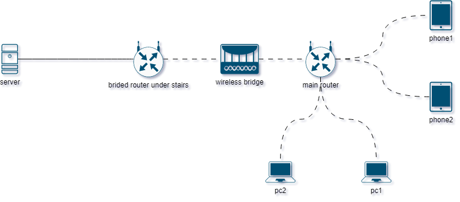

# Server Documentation

## Network

## Server

### Laptop specifications: 
Static hostname: server
Icon name: computer-laptop
Chassis: laptop
Machine ID: fb48ebf01d7843eeab33de20f4690dbd
Boot ID: a6c28a3b177d402f863edc01eda2e993
Operating System: Ubuntu 22.04.2 LTS
Kernel: Linux 5.15.0-67-generic
Architecture: x86-64
Hardware Vendor: Lenovo
Hardware Model: Lenovo B51-30
Version: Intel(R) Celeron(R) CPU  N3050  @ 1.60GHz
Core Count: 2
Thread Count: 2
RAM: 8 GB
HDD: 160GB

| **General information** |                 |           |
| ------------------- | --------------- | --------- |
| Server Role:        | practice server |           |
| Domain:             |                 |           |
| IP address:         | 192.168.0.241   |           |
| MAC address         | 1c:39:47:3b:b1:8a                |           |
| Service Account:    | Username:       | Password: |
| Hostname:        | server          |           |
| Physical/Virutal:   | Physical        |           |
| Location:           | under stairs    |           |
| Status:             | Up              |           |

### Logical drives
| **Logical drives** | Size  | Used | 
| ------------------ | ----- | ---- |
| /                  | 160GB |      |

### Network information
| Interface | index | enabled | ip  | mac | mtu | portspeed | 
| --------- | ----- | ------- | --- | --- | --- | --------- |
| eth       |       |         |     |     |     |           |
| wpls      |       |         |     |     |     |           |

### Local accounts
| User    | Password | Sudoer | Permissions |
| ------- | -------- | ------ | ----------- |
| milos   |          |        |             |
| mihajlo |          |        |             |
| root    |          |        |             |

### Local group accounts
| Group name    | Group ID | Members |
| ------- | -------- | ------ | 
|   adm |          |        |  
| sudo |          |        |       

## Services
| **Service** | **State** |
| ----------- | --------- |
| SSH         | up        |
| SAMBA       | up        |
| Cockpit     | up        |
| ufw         | up        |
| nginx            | its complicated           |
| python cluster | dockerized    |
| gns3 cluster   | removed    |
| netbox               |  up  |

---

#### netbox
superuser: milossuper
pass: super123

#### portainer
admin
sifrasifra123